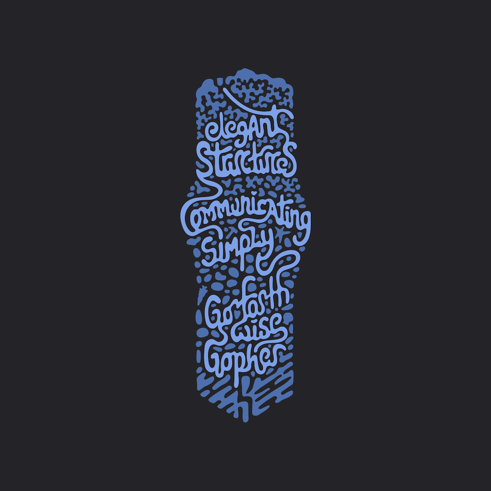

# code-execution-go

Use Heroku Dynos as a Go code execution environment within your AI applications. Large Language Models (LLMs) can use this Heroku app to boot [one-off dynos](https://devcenter.heroku.com/articles/one-off-dynos), install Go modules, and compile and run Go code.

Best of all, the app is free to deploy and does not require actively running Dynos.

## Deploy the app on Heroku

Click the deploy button below to deploy the app to your Heroku account:

> [!NOTE]
> The deployed app does not actively run Dynos or other add-on resources. However, spinnng up one-off Dynos will incur costs. Learn more about [Dyno Usage and Costs](https://devcenter.heroku.com/articles/usage-and-billing#dyno-usage-and-costs).
